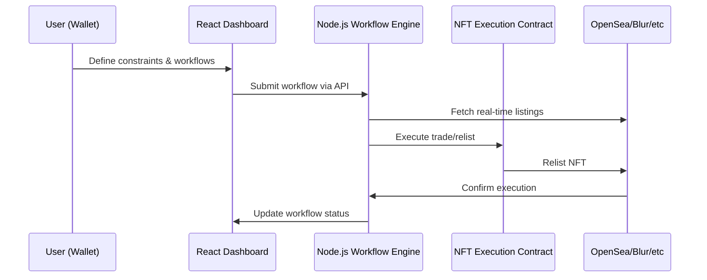

# Flipwire Architecture Overview

Flipwire is a cross-market NFT aggregation and execution platform. Its architecture is designed for **low-latency data aggregation**, **trustless execution**, and **non-custodial user control**.

## 🏗️ Components

### 1. Frontend
- React-based dashboard
- Wallet integration via **Privy / Web3Auth**
- Displays NFT listings, user workflows, and real-time alerts

### 2. Backend
- Node.js + TypeScript
- Listens to marketplace events via WebSocket/API
- Evaluates user-defined constraints (floor price, rarity, collection)
- Triggers smart contract execution for relisting or purchase
- Stateless, all sensitive info stays in client wallets

### 3. Smart Contracts
- ERC-721/ERC-1155 interfaces for executing relistings
- Supports trustless automation via signed messages
- Tracks workflow execution for transparency

### 4. Database & Caching
- **MongoDB** — persistent user workflows and history
- **Redis** — in-memory caching for rapid marketplace updates

---

## 🔄 Data Flow

